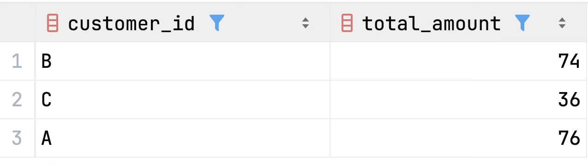

# [Case Study #1 - Danny's Diner](https://8weeksqlchallenge.com/case-study-1/)

<!-- TOC -->
* [Case Study #1 - Danny's Diner](#case-study-1---dannys-diner)
  * [Introduction](#introduction)
  * [Problem Statement](#problem-statement)
  * [Entity Relationship Diagram](#entity-relationship-diagram)
  * [Solutions of Case Study Questions](#solutions-of-case-study-questions)
    * [1. What is the total amount each customer spent at the restaurant?](#1-what-is-the-total-amount-each-customer-spent-at-the-restaurant)
    * [2. How many days has each customer visited the restaurant?](#2-how-many-days-has-each-customer-visited-the-restaurant)
    * [3. What was the first item from the menu purchased by each customer?](#3-what-was-the-first-item-from-the-menu-purchased-by-each-customer)
    * [4. What is the most purchased item on the menu and how many times was it purchased by all customers?](#4-what-is-the-most-purchased-item-on-the-menu-and-how-many-times-was-it-purchased-by-all-customers)
    * [5. Which item was the most popular for each customer?](#5-which-item-was-the-most-popular-for-each-customer)
    * [6. Which item was purchased first by the customer after they became a member?](#6-which-item-was-purchased-first-by-the-customer-after-they-became-a-member)
    * [7.Which item was purchased just before the customer became a member?](#7which-item-was-purchased-just-before-the-customer-became-a-member)
    * [8. What are the total items and amount spent for each member before they became a member?](#8-what-are-the-total-items-and-amount-spent-for-each-member-before-they-became-a-member)
    * [9. If each $1 spent equates to 10 points and sushi has a 2x points multiplier, how many points would each customer have?](#9-if-each-1-spent-equates-to-10-points-and-sushi-has-a-2x-points-multiplier-how-many-points-would-each-customer-have)
    * [10. In the first week after a customer joins the program (including their join date), they earn 2x points on all items, not just sushi – how many points do customer A and B have at the end of January?](#10-in-the-first-week-after-a-customer-joins-the-program-including-their-join-date-they-earn-2x-points-on-all-items-not-just-sushi--how-many-points-do-customer-a-and-b-have-at-the-end-of-january)
  * [Bonus Questions – Join and Rank All The Things](#bonus-questions--join-and-rank-all-the-things)
<!-- TOC -->

## Introduction

Danny seriously loves Japanese food, so at the beginning of 2021, he decides to embark upon a risky venture and opens up
a cute little restaurant that sells his three favourite foods: sushi, curry, and ramen.

Danny’s Diner is in need of your assistance to help the restaurant stay afloat – the restaurant has captured some very
basic data from their few months of operation but have no idea how to use their data to help them run the business.

## Problem Statement

Danny wants to use the data to answer a few simple questions about his customers, especially about their visiting
patterns, how much money they’ve spent, and also which menu items are their favourite. Having this deeper connection
with
his customers will help him deliver a better and more personalized experience for his loyal customers.

He plans on using these insights to help him decide whether he should expand the existing customer loyalty program –
additionally, he needs help to generate some basic datasets so his team can easily inspect the data without needing to
use SQL.

Danny has provided you with a sample of his overall customer data due to privacy issues – but he hopes that these
examples are enough for you to write fully functioning SQL queries to help him answer his questions!

## Entity Relationship Diagram

Danny has shared with you three key datasets for this case study:

- `sales`: captures all `customer_id` level purchases with a corresponding `order_date` and `product_id` information for
  when and what menu items were ordered.
- `menu`: maps the `product_id` to the actual `product_name` and `price` of each menu item.
- `members`: captures the `join_date` when a `customer_id` joined the beta version of the Danny’s Diner loyalty program.


## Solutions of Case Study Questions

### 1. What is the total amount each customer spent at the restaurant?

To calculate the total amount each customer spent at the restaurant, I join the `sales` table with the `menu` table
using a left join to connect each sale with its corresponding price information. Once I have both the customer ID and
the price for each purchase, I use the `sum()` aggregate function to add up all the prices for each customer. The
`group by` clause ensures that these totals are calculated separately for each customer, giving me the total spending
amount per customer.

```sql
select
    sales.customer_id
    , sum(menu.price) as total_amount
from sales
left join menu on menu.product_id = sales.product_id
group by sales.customer_id
;
```



### 2. How many days has each customer visited the restaurant?

To determine how many days each customer visited the restaurant, I query the `sales` table and count the distinct order
dates for each customer. I use `count(distinct)` rather than just `count()` because a customer might make multiple
purchases on the same day, but we only want to count each unique visit date once. The `group by` clause groups the
results by customer ID, so I get a separate count of visit days for each customer.

```sql
select
    sales.customer_id
    , count(distinct sales.order_date) as number_of_dates
from sales
group by sales.customer_id
;
```

### 3. What was the first item from the menu purchased by each customer?

To determine what was the first item from the menu purchased by each customer, I join the sales and menu tables to
combine order information with product details. Then, I use the dense_rank() window function to assign a ranking to each
purchase, partitioning by customer ID and ordering by order date. This means each customer gets their own set of
rankings, where their earliest purchase date receives rank 1. After creating this ranked dataset, I filter to keep only
the rows where the rank equals 1, which represents the first purchase(s). The distinct keyword ensures we don't show
duplicate entries if a customer bought the same item multiple times on their first visit.

```sql
with item_purchased_order as
         (select sales.customer_id
               , menu.product_name
               , sales.order_date
               , dense_rank() over (
                 partition by sales.customer_id
                 order by sales.order_date
                 ) as row_order
          from sales
                   left join menu on menu.product_id = sales.product_id)
select distinct customer_id, product_name, order_date
from item_purchased_order
where row_order = 1
;
```

### 4. What is the most purchased item on the menu and how many times was it purchased by all customers?

To identify the most purchased item on the menu, I join the `sales` table with the `menu` table to get product names.
Then, I group the results by product ID and product name, counting how many times each product appears in the sales
records. This gives me the purchase count for each menu item. Finally, I order the results by the purchase count in
descending order and limit the output to just the top result, which will be the most frequently purchased item along
with its total purchase count.

```sql
with purchased_item_count as (
    select 
        sales.product_id
         , menu.product_name
         , count(sales.product_id) as puchased_count
    from sales
    inner join menu
        on menu.product_id = sales.product_id
    group by
        sales.product_id
        , menu.product_name
)
select *
from purchased_item_count
order by puchased_count desc 
limit 1
;
```

### 5. Which item was the most popular for each customer?

To find the most popular item for each customer, I join the `sales` and `menu` tables, then group by customer ID and
product name to count how many times each customer purchased each item. I use the `dense_rank()` window function to rank
these counts within each customer's purchases, ordering by count in descending order so the most purchased items get
rank 1. If a customer has multiple items with the same highest purchase count, they'll all receive rank 1. Finally, I
filter to show only the items with rank 1 for each customer, revealing their most popular item(s).

```sql
with purchased_item_count_by_customer as (
    select
        sales.customer_id
        , menu.product_name
        , count(sales.product_id) as purchased_count
        , dense_rank() over (
            partition by customer_id
            order by count(sales.product_id) desc
        ) as purchashed_count_rank
    from sales
    inner join menu
        on menu.product_id = sales.product_id
    group by
        sales.customer_id
       , menu.product_name
)
select
    customer_id
    , product_name
    , purchased_count
from purchased_item_count_by_customer
where purchashed_count_rank = 1
;
```

### 6. Which item was purchased first by the customer after they became a member?

To determine the first item purchased by each customer after joining the loyalty program, I start with the `members`
table and join it with `sales`, filtering to include only purchases made on or after the customer's join date. I then
join with the `menu` table to get product names. Using the `dense_rank()` window function, I rank purchases by order
date within each customer's post-membership purchases, with the earliest purchase receiving rank 1. Finally, I filter to
show only the purchases with rank 1, which represents the first item(s) each customer bought after becoming a member.

```sql
with customers_purchases_after_becoming_member as (
    select
        members.customer_id
        , members.join_date
        , sales.order_date
        , menu.product_name
        , dense_rank() over (
            partition by members.customer_id
            order by sales.order_date
        ) as order_date_rank
    from members
    left join sales
        on
            sales.customer_id = members.customer_id
            and sales.order_date >= members.join_date
    left join menu
        on menu.product_id = sales.product_id
)
select
    customer_id
    , join_date
    , product_name
    , order_date
from customers_purchases_after_becoming_member
where order_date_rank = 1
;
```

### 7.Which item was purchased just before the customer became a member?

To find the item purchased just before a customer became a member, I start with the `members` table and join it with
`sales`, but this time I filter to include only purchases made before the customer's join date. After joining with the
`menu` table for product names, I use the `dense_rank()` window function to rank purchases by order date in descending
order (most recent first) within each customer's pre-membership purchases. This means the purchase closest to the join
date receives rank 1. I then filter to show only those purchases with rank 1, revealing the last item(s) each customer
bought before joining the loyalty program.

```sql
with customers_purchases_before_becoming_member as (
    select
        members.customer_id
        , members.join_date
        , sales.order_date
        , menu.product_name
        , dense_rank() over (
            partition by members.customer_id
            order by sales.order_date desc
        ) as order_date_rank
    from members
    left join sales
        on
            sales.customer_id = members.customer_id
            and sales.order_date < members.join_date
    left join menu
        on menu.product_id = sales.product_id
)
select
    customer_id
    , join_date
    , product_name
    , order_date
from customers_purchases_before_becoming_member
where order_date_rank = 1
;
```

### 8. What are the total items and amount spent for each member before they became a member?

To calculate the total number of items and total amount spent by each member before they joined the loyalty program, I
start with the `members` table and join it with the `sales` table, filtering to include only purchases made before the
customer's join date. I then join with the `menu` table to get the price information. Using aggregation functions, I
count the total number of products purchased and sum up all the prices for each customer. The `group by` clause ensures
these calculations are done separately for each member, giving us their pre-membership purchase summary.

```sql
select
    members.customer_id
    , count(sales.product_id) as total_items
    , sum(menu.price) as total_amount
from members
left join sales
    on
        sales.customer_id = members.customer_id
        and sales.order_date < members.join_date
left join menu
    on menu.product_id = sales.product_id
group by members.customer_id
;
```

### 9. If each $1 spent equates to 10 points and sushi has a 2x points multiplier, how many points would each customer have?

To calculate the loyalty points for each customer under the given rules, I join the `sales` and `menu` tables to get
both purchase and price information. For each purchase, I calculate points by multiplying the price by 10 (since $1 = 10
points), and then apply a conditional multiplier: if the product is sushi, I multiply by an additional 2 (giving sushi
purchases 20 points per dollar), otherwise I multiply by 1 (keeping it at 10 points per dollar). I sum up all these
calculated points for each customer using the `group by` clause, giving me the total points earned by each customer
across all their purchases.

```sql
select
    sales.customer_id
    , sum(
        10 
        * menu.price 
        * case
            when menu.product_name = 'sushi' then 2
            else 1
        end
    ) as points
from sales
left join menu
    on menu.product_id = sales.product_id
group by customer_id
;
```

### 10. In the first week after a customer joins the program (including their join date), they earn 2x points on all items, not just sushi – how many points do customer A and B have at the end of January?

To calculate points for customers A and B by the end of January with the special first-week bonus, I join the `sales`,
`members`, and `menu` tables. For each purchase, I calculate points by multiplying the price by 10, then apply
conditional multipliers: if the product is sushi, multiply by 2; if the purchase was made during the customer's first
week as a member (from join date to 6 days after), also multiply by 2; otherwise multiply by 1. I filter the results to
include only customers A and B, and only purchases made before February 1st, 2021. Finally, I sum up all the calculated
points for each customer, giving their total points earned in January under these promotional rules.

```sql
select
    sales.customer_id
    , sum(
        10
        * menu.price
        * case
            when menu.product_name = 'sushi' then 2
            when sales.order_date 
                between members.join_date 
                and members.join_date + interval '6 days'
            then 2
        else 1
    end
    ) as points
from sales
left join members
    on members.customer_id = sales.customer_id
left join menu
    on menu.product_id = sales.product_id
where
    sales.customer_id in ('A', 'B')
    and sales.order_date < '2021-02-01'
group by sales.customer_id
;
```

## Bonus Questions – Join and Rank All The Things

The following questions are related to creating basic data tables that Danny and his team can use to quickly derive
insights without needing to join the underlying tables using SQL. Danny also requires further information about the
ranking of customer products. However, he purposely does not need the ranking for non-member purchases, so he expects
`null` ranking values for the records when customers are not yet part of the loyalty program.

To create a comprehensive orders table that Danny's team can use without needing SQL joins, I combine data from the
`sales`, `menu`, and `members` tables. For each sale, I include the customer ID, their join date (if they're a member),
the order date, product name, and price. I add a member flag that shows 'Y' if the purchase was made on or after the
customer's join date, and 'N' otherwise. For the ranking column, I use a conditional case statement: if the customer was
a member at the time of purchase, I apply the `rank()` window function to assign rankings based on order date within
each customer's member purchases; if they weren't a member yet, the ranking remains null. This partitioning by both
customer ID and membership status ensures that rankings start fresh from when each customer joins, and non-member
purchases aren't ranked. Finally, I order the results by customer ID and order date for easy reading.

```sql
create table orders
as
select
    sales.customer_id
    , members.join_date
    , sales.order_date
    , menu.product_name
    , menu.price
    , case
        when sales.order_date >= members.join_date then 'Y'
        else 'N'
    end as member
    , case
        when sales.order_date >= members.join_date then rank() over (
            partition by
                sales.customer_id
                , sales.order_date >= members.join_date
            order by sales.order_date
        )
    end as rank
from sales
left join menu
    on menu.product_id = sales.product_id
left join members
    on members.customer_id = sales.customer_id
;

select *
from orders
order by customer_id, order_date
;
```